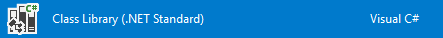
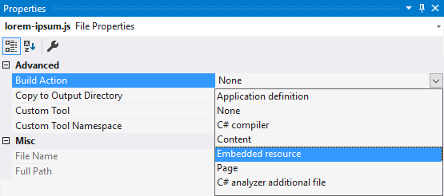
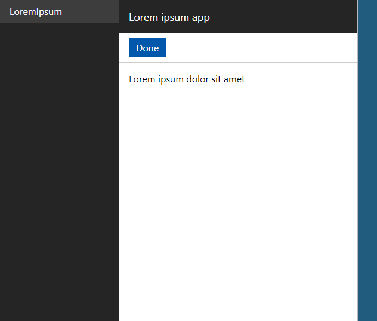

Consistent, modular, cross-platform, responsive management dialog UI.

Poetry UI is a home for your reusable functionality. It’s a web *portal* for *apps*, consisting of *blades*.

**Highlights:**

* Runtimes for both .NET Framework and .NET Core
* Written in modern, vanilla JS (no 💔 IE)

Here’s how it works
-----------

Everything is based on Components. Components are essentially assemblies annotated with an ID. They can include embedded Scripts and Styles.

Some components are built-in: Data tables, scaffolded forms, context menus.

You make Apps. Import jobs, management dialogs, you name it.

They need to belong to a Component. (ie. same project)

Your components and apps will then run on both .NET Core and .NET Framework.

Workflow
--------

To create a new “LoremIpsum” App, you create a new Class Library:

Define a LoremIpsumComponent class that will inform Poetry about your UI component.

It should look something like this:

    [Component("LoremIpsum")]
    public class LoremIpsumComponent
    {
    }

Then we make an LoremIpsumApp class.

Something like this will do:

    [App("LoremIpsum")]
    [Script("Scripts/lorem-ipsum.js")]
    public class LoremIpsumApp
    {
    }

Create `/Scripts/lorem-ipsum.js` and insert something like this:

    portal.addApp(new class extends App {
        constructor() {
            super('LoremIpsum');
        }

        open() {
            if (this.blades.length) {
                return;
            }

            this.openBlade(new LoremIpsumBlade(this));
        }
    });

    class LoremIpsumBlade extends Blade {
        constructor(app) {
            super();

            this.setTitle('Lorem ipsum app');

            this.setToolbar(
                new PortalButton('Done', () => app.closeBlade(this)),
            );

            this.setContent('Lorem ipsum dolor sit amet');
        }
    }

**This one's important:** Right-click the `lorem-ipsum.js` and select Properties. Then, in the Properties pane, click "Build Action" and choose "Embedded resource". Every time you update this file, you need to rebuild your project.

Then, in your consumer app, make sure you do the following at startup:

    .AddPoetryUI()
    .AddAssembly(typeof(LoremIpsumComponent).Assembly)
    .Done()

And 🎻 viola:

You can also supply your own API controllers for AJAX requests, make data table backends, forms mapping to POCOs, your own form field types, provide *on page editing*, and more.

Installation
------------

To get up to speed fast, just clone this repo and run the example websites. The default portal URL is `/Admin`.

NuGet packages aren't published yet.

Status
------

This software is very much in an unfinished alpha state. No semver, LTS, etc etc.

What’s more
-----------

Stay tuned. If you want to be emailed about updates specifically, contact me on bjorn.a.goransson@gmail.com